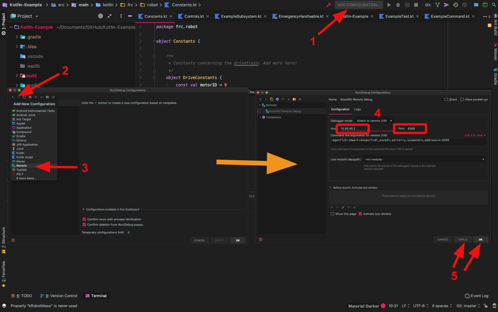
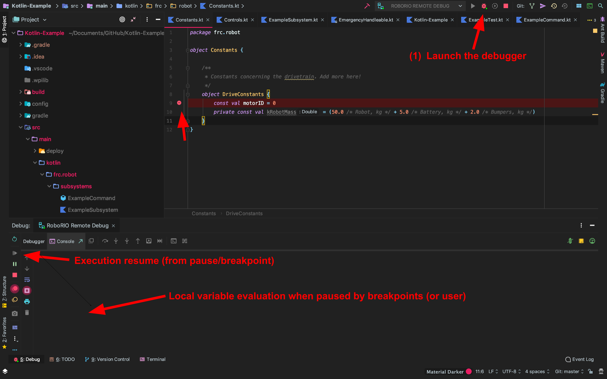

# Debugging robot code

Requirements: Command line access, [VisualVM](https://visualvm.github.io/download.html), a robot

## Configuring the robot's JVM for debugging

Start by modifying the gradle build file's [JVM](https://en.wikipedia.org/wiki/Java_virtual_machine) arguments. The necessary arguments are:
```
"-Dcom.sun.management.jmxremote=true",
"-Dcom.sun.management.jmxremote.port=1099",
"-Dcom.sun.management.jmxremote.local.only=false",
"-Dcom.sun.management.jmxremote.ssl=false",
"-Dcom.sun.management.jmxremote.authenticate=false",
"-Djava.rmi.server.hostname=10.59.40.2"
```

For example, within the artifact block in the Kotlin DSL, ensure you have the following [JVM](https://en.wikipedia.org/wiki/Java_virtual_machine) args:
```
jvmArgs = listOf(
        "-Xmx20M",
        "-XX:+UseG1GC",
        "-Dcom.sun.management.jmxremote=true",
        "-Dcom.sun.management.jmxremote.port=1099",
        "-Dcom.sun.management.jmxremote.local.only=false",
        "-Dcom.sun.management.jmxremote.ssl=false",
        "-Dcom.sun.management.jmxremote.authenticate=false",
        "-Djava.rmi.server.hostname=10.59.40.2"
)
```

Furthermore ensure that debugging is available to be set in Gradle with `debug = frc.getDebugOrDefault(false)` (or the groovy equivalent) present somewhere in FRCJavaArtifact artefact block.

Deploy the robot code with the new JVM arguments with the command `./gradlew build -PdebugMode`, and set the Driverstation to show prints or open RioLog in VSCode. When you do, you should see a message along the lines of "Debugging active on port {port}!" This port is usually [port](https://en.wikipedia.org/wiki/Port_(computer_networking)) 8349, but can be different sometimes depending on options. If it is different, replaces further references to port 8349 with the port printed out by the robot. Note that until you "attach" to the robot [JVM](https://en.wikipedia.org/wiki/Java_virtual_machine) with a debugger the code will not continue execution -- in fact, the robot code will not even start!

While debugging Java code from VSCode is officially supported, debugging Kotlin code from VSCode is **not**. For this reason, if you are using Kotlin, I would debug with IntelliJ.

## Debugging with IntelliJ

A general article on debugging with IntelliJ is available from JetBrains [here](https://www.jetbrains.com/help/idea/debugging-code.html). The process is simple -- attach IntelliJ's built-in debugger to the robot's JVM, and then get started killing bugs! In general, you will be setting breakpoints, evaluating local variables and then continuing execution using the debugger. Note that for local variables, their value is supplied by the `toString()` method, so any data classes or other user created objects should override the `toString()` method to assist in debugging.

### Attaching to the robot JVM remotely

The first step to begin debugging is to attach IntelliJ's debugger to the robot's [JVM](https://en.wikipedia.org/wiki/Java_virtual_machine), which itself runs the robot code. The code will not run until the debugger is attached! The debugger setup and and attachment process is as follows:



Under the top bar, (1) click add configuration (if you already have a configuration, add the configuration from the dropdown menu using "edit configurations"). (2 & 3) Add a new "remote" configuration, and (4) configure it with the RoboRIO port (10.TE.AM.2 over WIFI, and we're team 5940 :| ) and our port. (5) Apply and exit with Ok. Now that you have your debug configuration setup, ensure that it is the active configuration -- if not, select it from the dropdown from step (1). 

Next, let's attach out debugger to the RoboRIO. If you are not yet connected to a robot over Wifi that is awaiting a debug connection, go back to [Configuring the robot's JVM for debugging](#configuring-the-robots-jvm-for-debugging). Attach the debugger with the debug button, and start playing with some [breakpoints](https://en.wikipedia.org/wiki/Breakpoint)! Keep in mind that while the *robot* code will pause, controls running on Talons will *not*! Talons will continue to do what they were last asked to do, including yeeting forward into a wall.

