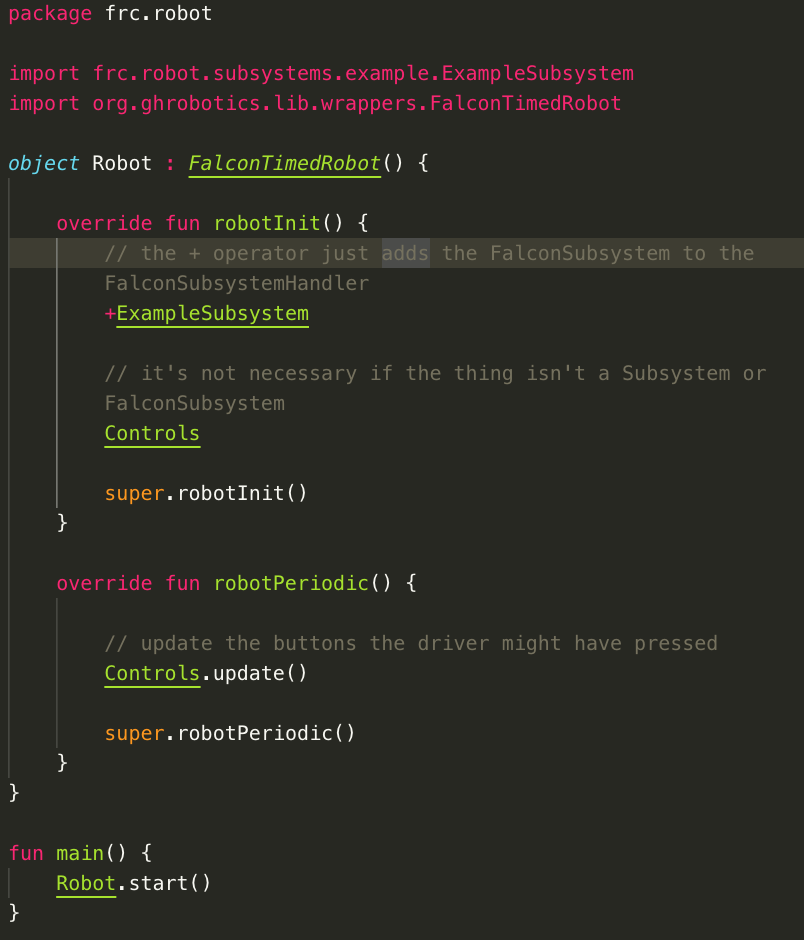
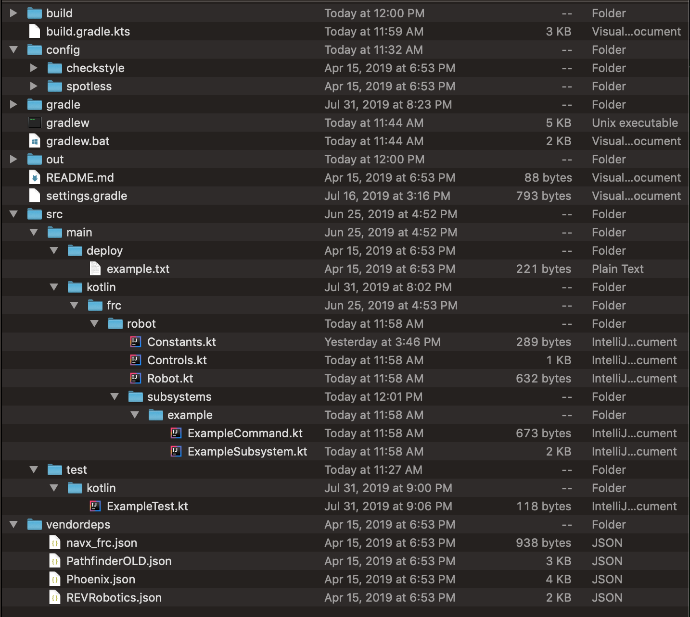
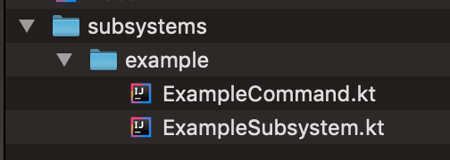
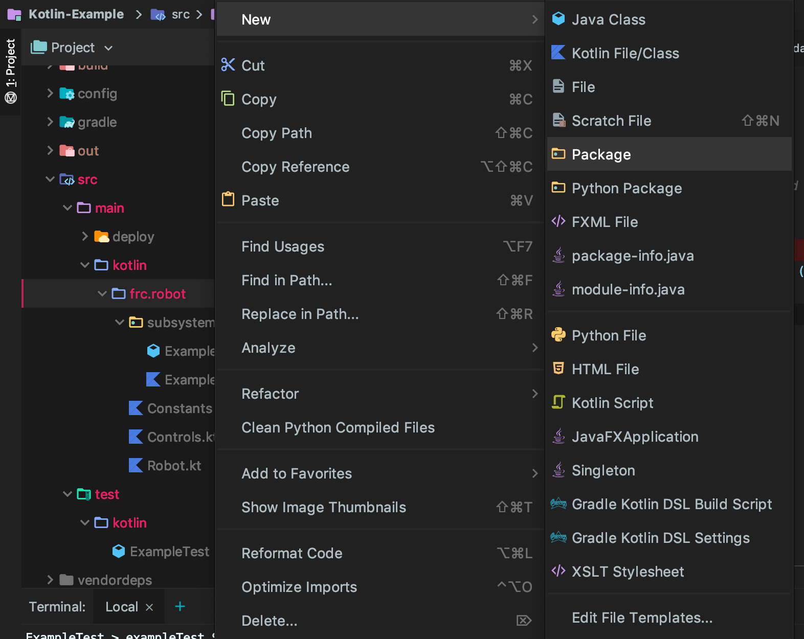
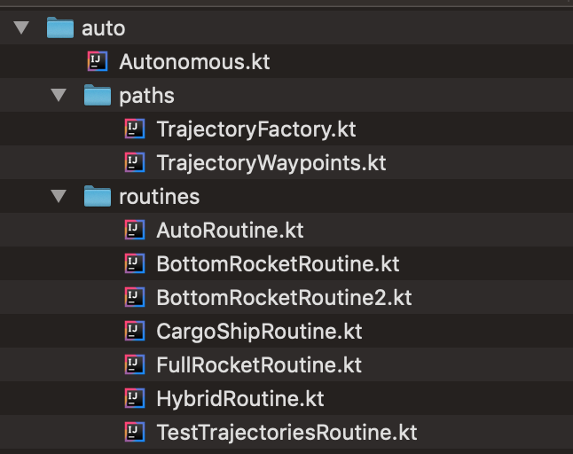

# Robot code structure

In a project, source code files are stored in [source sets](https://docs.gradle.org/current/dsl/org.gradle.api.tasks.SourceSet.html), folders which contain either the code itself or subfolders with code inside it. Gradle can *technically* configured to [include additinal source sets](https://stackoverflow.com/questions/11581419/how-do-i-add-a-new-sourceset-to-gradle), but is not necessary. By default, Java files are looked for in the `src/main/java` folder, while Kotlin files are looked for in `src/main/java` or `src/main/kotlin`.

This is the structure of the Kotlin example program. You can [download it from github here](https://github.com/BREAD5940/Kotlin-Example).

## The Robot.kt/Robot.java file



The main Robot file is run when the robot code first starts. For more information on `FalconTimedRobot`, [see this writeup](docs/guides/falconlib/commandBased?id=falcontimedrobot). `FalconTimedRobot` is basically a wrapper around `TimedRobot`, and includes methods for resetting subsystems at key points and other cleanup methods. It's suggested to use it over using WPI's base class for robots, `TimedRobot`. Both the following methods, which are automatically called when the indicated event takes place:

```java
public void robotInit() {} // run when the robot first starts, useful for instantiating hardware 
public void disabledInit() {} // run when the robot first enters disabled mode (including disable from teleop)
public void autonomousInit() {} // run when the robot first enters autonomous mode
public void teleopInit() {} // run when the robot first enters teleop mode
public void testInit() {} // run when the robot first enters test mode
public void robotPeriodic() {} // run constantly always while the robot is on
public void disabledPeriodic() {} // run constantly while the robot is disabled in addition to robotPeriodic
public void autonomousPeriodic() {} // run constantly while the robot is enabled in autonomous in addition to robotPeriodic
public void teleopPeriodic() {} // run constantly while the robot is enabled in teleop in addition to robotPeriodic
public void testPeriodic() {} // run constantly while the robot is enabled in test mode in addition to robotPeriodic
```

In general there should be no logic within the main `Robot` file, as the intended function of the class is to simply instantiate other classes. For example, Robot class should not handle selecting, entering or exiting autonomous mode, containing joysticks or polling buttons -- these tasks should be handled by their own classes. For example, example program has a seperate class for `Controls`, which holds the driver xbox controller.

Further documentation from WPI is avalible on the [WPILib API documentation](https://first.wpi.edu/FRC/roborio/release/docs/java/edu/wpi/first/wpilibj/TimedRobot.html). None, one or all of these methods may be [overridden](https://www.geeksforgeeks.org/overriding-in-java/). The following example robot will simply print every time it's turned on in teleop mode

```kotlin
class Robot : TimedRobot() {
    override fun teleopInit() = println("Hello, world!")
}
```

## Folder structure and necessary files



Let's look at all the folders from the top down. The following folders and files do _not_ contain user code, but rather compiled files and configuration.

Folders:
- build, which stores compiled binary files (not user editable code)
- config, which stores configuration for the [code formatter to follow](docs/guides/generalRobot/introToGradle?id=linting-and-code-format-checks)
- gradle, which stores the Gradle JAR itself
- vendordeps, which stores links to libraries for the [NavX Gyro](https://www.andymark.com/products/navx-mxp-robotics-navigation-sensor), [CTRE motor controllers](http://www.ctr-electronics.com/control-system.html), and more

Files:
- build.gradle.kts (or build.gradle) stores Gradle configuration for plugins, code deployment and more
- gradlew and gradlew.bat, the gradle wrapper scripts
- README.md, information about the project
- settings.gradle stores configurations for local library caching and [include local projects](https://stackoverflow.com/a/19303545)

## The src (main source) folder

The `src`, or source, folder itself contains subfolders as pictured. Everything is stored within `src/main`. The contents of the `deploy` folder are sent to the RoboRIO and stored in the RoboRIO directory `/home/lvuser/deploy`. We previously put Pathfinder v1 pre-time-parametrized trajectories there, but any file can be put there. Inside the `kotlin` (or `java`) file is where the real fun happens though. Files placed within this folder have no package, as they are at the root of the project. We store our code within `frc/robot`, so for example `Robot.kt` is of the `package frc.robot`. Read more about packages [here](https://www.geeksforgeeks.org/packages-in-java/), and note that they should [always be lower case](https://stackoverflow.com/a/12534322). All files within the `kotlin` or `java` folder will be compiled though! By default, the gradle build file is configured to look for the robot main class on the line `val kMainRobotClass = "frc.robot.RobotKt"` (the Kt appended to the end is [because of the way that static functions and member variables are put into a separate file when compiled](https://kotlinlang.org/docs/reference/java-to-kotlin-interop.html)).

The `frc/robot` folder is where everything starts. It contains the main `Robot` file, as well as universal `Constant`s and the robot `Control` bindings. [Download the project](https://github.com/BREAD5940/Kotlin-Example) and poke around for yourself, most stuff should be commented. 

## Subsystems and their Commands



The `frc/robot` package also contains a `subsystem` folder. Here we put one folder for each of our subsystems; this folder contains both the Subsystem itself as well as it's associated commands. In this example, the `ExampleSubsystem` lives in the `frc/robot/example` package; this package contains not just the `ExampleSubsystem` itself, but also an `ExampleCommand` which [requires](https://frc-docs.readthedocs.io/en/latest/docs/software/commandbased/subsystems.html) the Subsystem. Again, for more on Command-based, read the frc-docs article [here](https://frc-docs.readthedocs.io/en/latest/docs/software/commandbased/subsystems.html), and more on Falcon Command-based [here](docs/guides/falconlib/commandBased). If you want to add say a `DriveSubsystem`, first create a `drive` folder within the `subsystem` package, and add your `DriveSubsystem` and any other commands that may require the `DriveSubsystem` also within the `drive` package. Again, note that the [naming convention for packages is all lower case](https://stackoverflow.com/a/12534322) to avoid conflicting names of classes and packages; classes are written in [PascalCase](http://wiki.c2.com/?PascalCase).

## Command groups and autonomous

Base Commands should only require one subsystem, so this convention works well for a little while — at least until you want to try writing command groups. When you do, you will quickly realize the need to put these elsewhere. If you haven't yet, [download the example project](https://github.com/BREAD5940/Kotlin-Example) and [get IntelliJ set up to run it](docs/guides/introToGradle). To store our autonomous groups, we're going to create a new package, or folder, under the `frc/robot` package. We'll call it `autonomous`, and put our groups and routines under the `routines` folder. To do this, right click on the `robot` (or `frc.robot`) package in IntelliJ and select new, then package.





