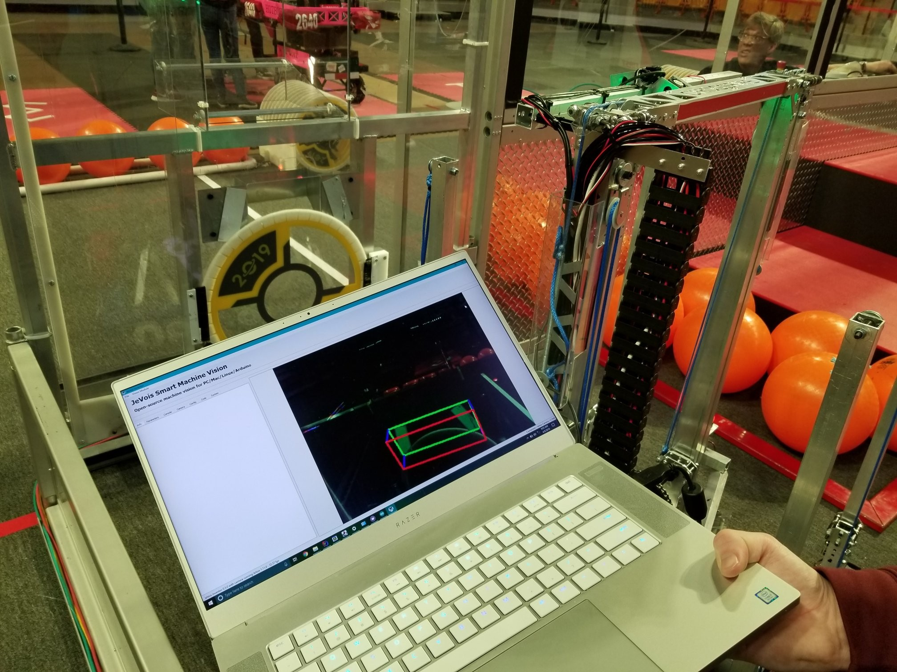
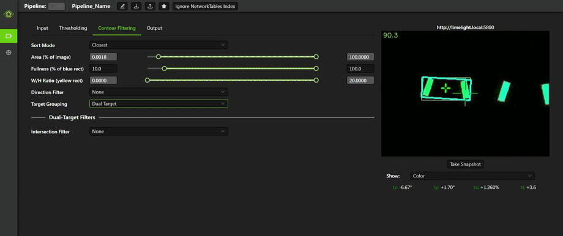
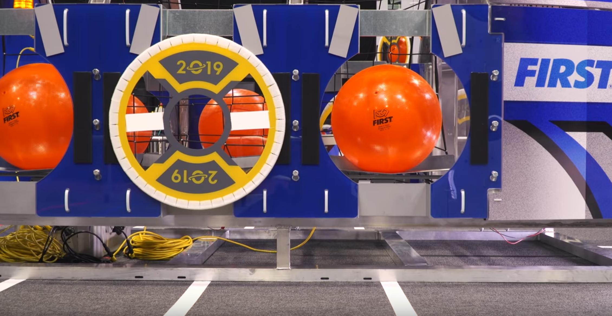

# What is Computer Vision in FRC?

Computer Vision, often abbreviated Vision or CV, is the process of using cameras and computers to detect the position of [strips of reflective tape often placed around goals or game piece retrieval locations](https://docs.wpilib.org/en/latest/docs/software/vision-processing/introduction/target-info-and-retroreflection.html).

(Thanks to 5190 for the image)

When using vision, an image is captured by a camera and processed to find the bright (often green) LED strips. Using information about the size or positions of the strips, the robot can determine it's location, which is often used to automatically steer the robot to the goal. The process of identifying targets is more specifically detailed [on this frc-docs page](https://docs.wpilib.org/en/latest/docs/software/vision-processing/introduction/identifying-and-processing-the-targets.html), but generally goes as follows:
- Illuminate the target with a bright light source
- Capture an image using a camera placed adjacent to the light source
- Filter out parts of the image which aren't approximately the same color as the bright light
- Sort the resulting blobs of light by their size, shape, angle and other characteristics
- Determine which of the blobs is most likely to be the target
- Send information about the target's angle (say, in degrees from the center of the camera) to the robot over [NetworkTables](https://docs.wpilib.org/en/latest/docs/software/networktables/networktables-intro.html) or [USB serial libraries such as JSerialComm](https://fazecast.github.io/jSerialComm/), or do additional processing to determine distance and angle to the target
- Use this information on the robot to automatically steer towards the target or relocalize the robot

(From [Limelight's docs](http://docs.limelightvision.io/en/latest/software_change_log.html))

The 2019 game presented a particularly difficult challenge, as the the vision targets (the white strips above the hatches) were separate. To identify targets, systems would need to determine which pairs of targets were supposed to be grouped together based on their angle and treat the pair as a single target.

## What do we use?

In 2019, we used a combination of Limelight 2 and 5190's Jevois code to target targets on the front and back of the robot. We found the distance and angle to the target using the Limelight's target width and x angle, and used SolvePNP along with a [a bunch of Python on the JeVois](https://github.com/BREAD5940/Offseason-Croissant/blob/2020/vision/jevoisvision/modules/ghrobotics/ReflectiveTape/ReflectiveTape.py). The distance and angle are used to create the vision target's Pose2d relative to the bot, which are then transformed into the global reference frame and added to the target tracker. Targets can then be found as a Pose2d in the global reference frame, and because the robot keeps track of it's position with odometry the pose of the vision targets is also known relative to the robot. The angle of the translation of the vision target either closest to the robot or to an absolute field relative pose in the robot's frame of reference is used to run a PD controller, which is used to angle the robot to the goal while the driver drives forward and backwards to place hatches and cargo.

## What should I do now?

First, you should learn how to program a simple vision command using the Limelight. Read [Limelight's documentation here](http://docs.limelightvision.io/en/latest/index.html). Start by [tuning your own vision pipeline to detect targets](http://docs.limelightvision.io/en/latest/vision_pipeline_tuning.html), and the read their [2019 case study to aim at a target](http://docs.limelightvision.io/en/latest/cs_drive_to_goal_2019.html) and try implementing something like it in your code. You can also look at [5190's target tracker, which we used](https://github.com/BREAD5940/Offseason-Croissant/blob/2020/src/main/kotlin/frc/robot/vision/TargetTracker.kt), but it's pretty confusing.