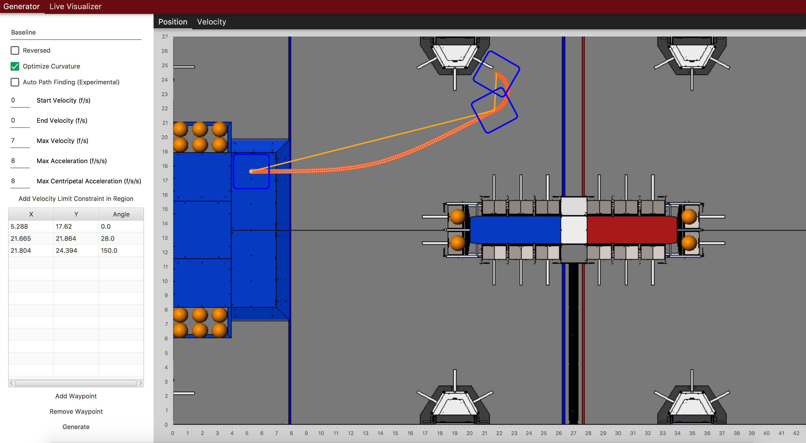
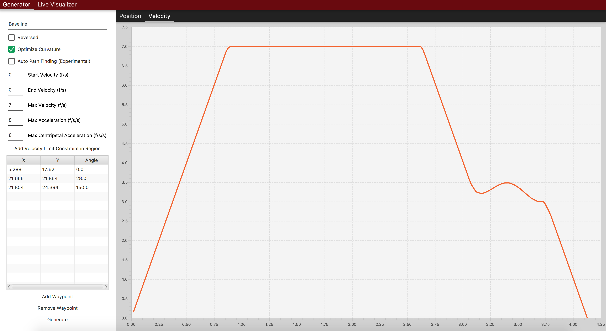

# FalconDashboard

Falcon Dashboard is a Kotlin-based utility that can be used to generate
trajectories and visualize the robot's position on the field live. This
utility uses FalconLibrary as the backend trajectory generation code,
and generates code that can be pasted into your robot code. The source
code is publicly available at https://github.com/5190GreenHopeRobotics/FalconDashboard





## Running FalconDashboard

Clone or download the repository, and execute
`./gradlew run` from within the project root
directory. Note that some school's (including ours) block
the necessary dependencies. While we do NOT endorse
circumventing the school protections, a hotspot may be your
best bet.

## Generating code


To generate code, just click `Generate` and paste the code into
a command or command group. Specific implementation will vary
user to user. See Following Trajectories (TODO Link) for more
information. One example might be:

```java
        TimedTrajectory<Pose2dWithCurvature> traject = TrajectoryGeneratorKt.getDefaultTrajectoryGenerator().generateTrajectory(
                Arrays.asList(
                    new Pose2d(LengthKt.getFeet(5.634),
                            LengthKt.getFeet(17.719),
                            Rotation2dKt.getDegree(0)),
                    new Pose2d(LengthKt.getFeet(18.36),
                            LengthKt.getFeet(19.143),
                            Rotation2dKt.getDegree(0)),
                    new Pose2d(LengthKt.getFeet(20.822),
                            LengthKt.getFeet(25.301),
                            Rotation2dKt.getDegree(153.33))
                ),
                Arrays.asList(new CentripetalAccelerationConstraint(
                        AccelerationKt.getAcceleration(LengthKt.getFeet(8.0)))),
                VelocityKt.getVelocity(LengthKt.getFeet(0.0)),
                VelocityKt.getVelocity(LengthKt.getFeet(0.0)),
                VelocityKt.getVelocity(LengthKt.getFeet(7.0)),
                AccelerationKt.getAcceleration(LengthKt.getFeet(8.0)),
                false,
                true
                        );

        addSequential(new FollowPathCommand(traject, true, m_DriveBase);
```
```kotlin
        var traject = DefaultTrajectoryGenerator.generateTrajectory(

                Arrays.asList(
                    Pose2d(5.634.feet,
                            17.719.feet,
                            0.degree),
                    Pose2d(18.36.feet,
                            19.143.feet,
                            0.degree),
                    Pose2d(20.822.feet,
                            25.301.feet,
                            153.33.degree)
                ),
                Arrays.asList(CentripetalAccelerationConstraint(
                        8.0.feet.acceleration)),
                0.0.feet.velocity,
                0.0.feet.velocity,
                7.0.feet.velocity,
                8.0.feet.acceleration,
                false,
                true
        )

        addSequential(FollowPathCommand(traject, true, m_DriveBase);

```

The `DefaultTrajectoryGenerator` is just one instance
of FalconLib's `TrajectoryGenerator`, with settings
adjusted to minimize generation time while maintaining
plenty of accuracy. For more information on paths, path constraints, and path following see [Pathing with FalconLib](docs/learn/falconlib/pathing)
